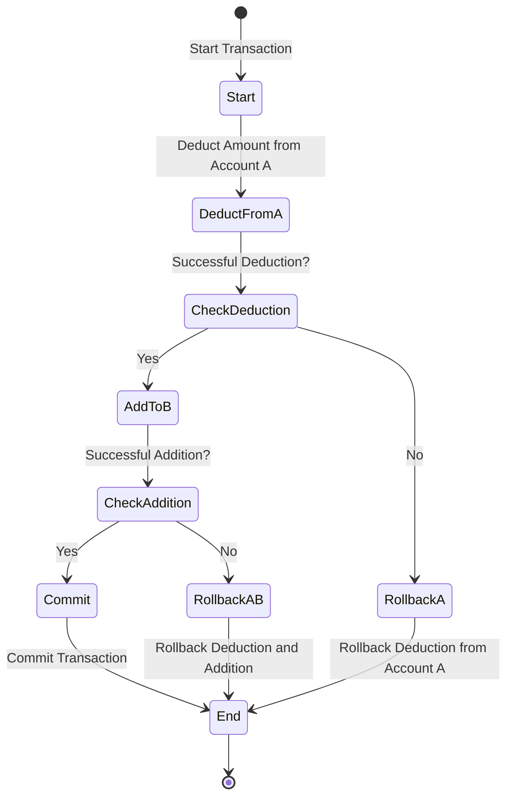

# ACID 

A - atomicity
C - Consistency 
I - Isolation
D - Durability 

## Atomicity 

Atomicity ensures that a transaction is treated as a single "unit of work." This means that either all the operations within the transaction are executed successfully, or none of them are. There is no in-between state where some operations have completed and others have not.

* All-or-Nothing Principle:
* Rollback Mechanism:
* Commit:
* Failure Handling:

